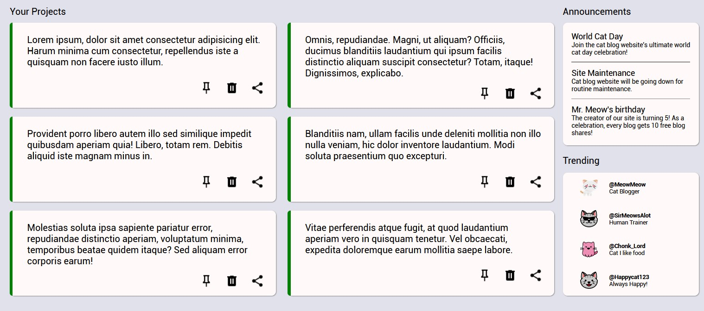
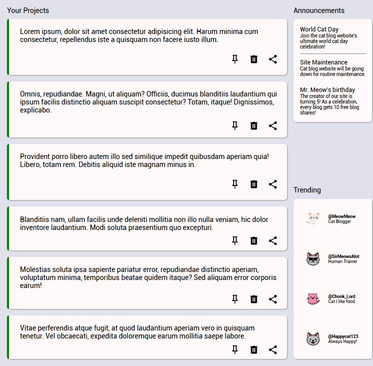
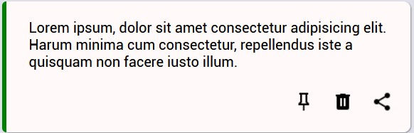

# grid-dashboard

This is a project to practice CSS grid. Take a look here: https://erictgoto.github.io/cat-dashboard 

Icons taken from materialdesignicons.com and flaticon.com.

For the project card section, I utilized repeat, auto-fit and minmax to create a dynamic card layout depending on the display size.
Here is what the cards look like in full screen on my 1920x1080 screen:

When I view the same cards in windowed mode:

The left of the card has a green line. This was made using the pseudo element ::before and absolute positioning.

